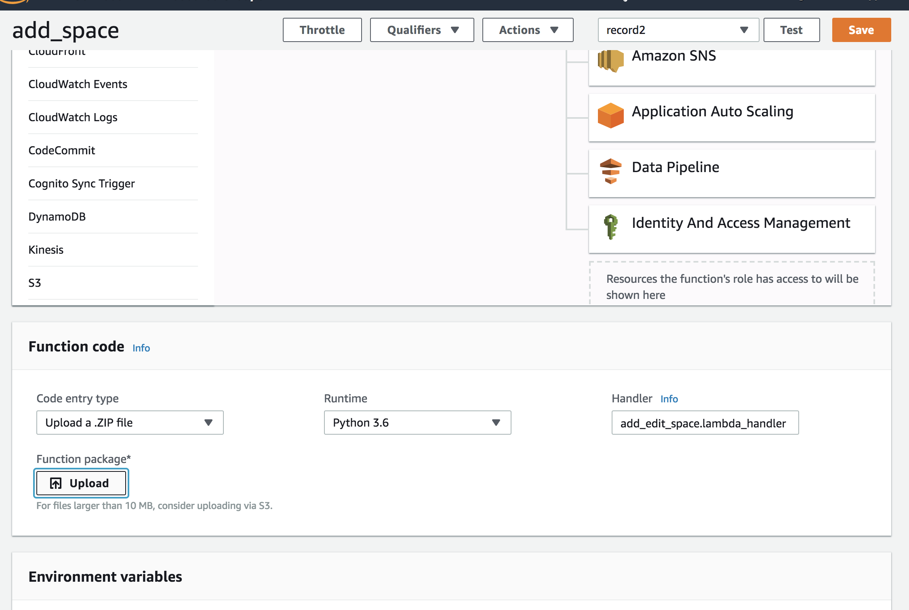

# EMP Add/Edit space lambda function

AWS lambda function to process add/edit space requests.

## Getting Started

These instructions will get you a copy of the Add/Edit lambda function up and running on your own AWS account for 
development and testing purposes. 

### Prerequisites

## Local development environment

* Python 3
* pip
* virtualenv
* Active AWS Account to deploy service

### Installation/Deployment

## Package lambda function with dependencies 

1. Create virtual environment: `virtualenv ~/lambda-virt`
2. Activate it: `source ~/lambda-virt/bin/activate`
3. Install dependencies in order to `pip install -r requirements.txt -t .`
4. Archive lambda function with dependencies `zip -r ../emp_lambda_v1.zip . -x *.git*`

*NB:* boto3 is excluded from `requirements.txt`. it is pre-installed in python AWS environment.

### Deployment

1. Use either [CloudFormation](https://github.com/roman-burdakov/emp-aws-stack-cf) or manually 
update your existing function through web console
    * If stack was already provisioned, you can simply update your existing function:
    ```
    Services -> Lambda -> <Select Your Function> -> Seach for drop down under 
        "Code entry type" -> Select "Upload a zip file" -> Save
    ```
    


## Contributing

Free to use and distribute. Use it at your own risk and additional charges might apply to your account for using AWS Services.

## Acknowledgments

* Inspired by Angelo Morello for Enhanced Meeting Planner project
